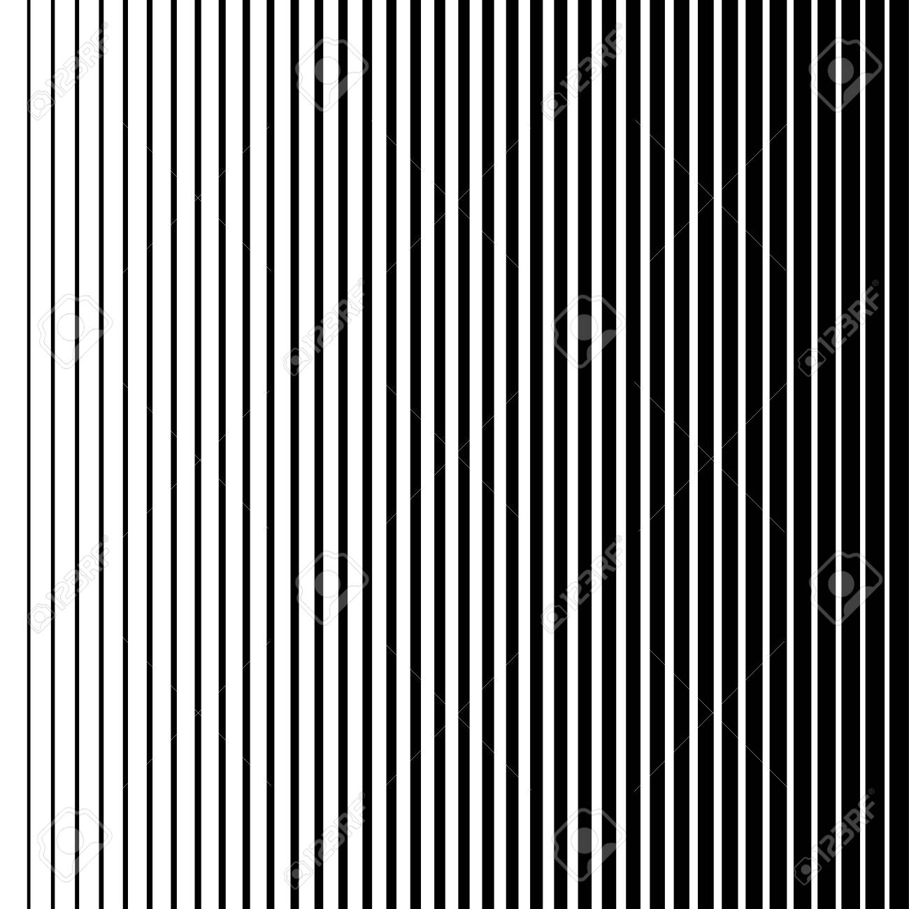

# yyan0203_9103_tut3_GroupC

I'm Yuance Yan from IDEA 9103 Tut 3 Group C.

I chose the Time-Based method for my major project

Lines will be automatically generated, in the process of generating the colour will be gradient, click the mouse to restart, all generated after clicking the mouse again will continue to restart the generation. And every time you refresh the line will become a different colour.

My process has changed a lot because I initially chose Perlin Noise but it seemed a bit difficult, time-based is relatively easy compared to Perlin Noise.

I was partly inspired by the image below, where all the lines are in one colour system, like yellow, but in different shades, like from dark yellow to light yellow.
